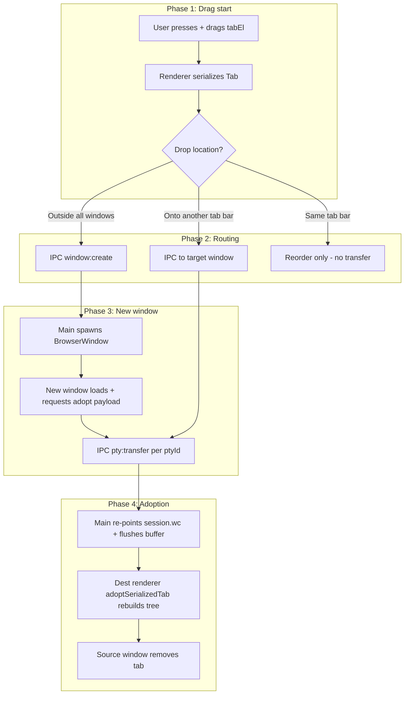
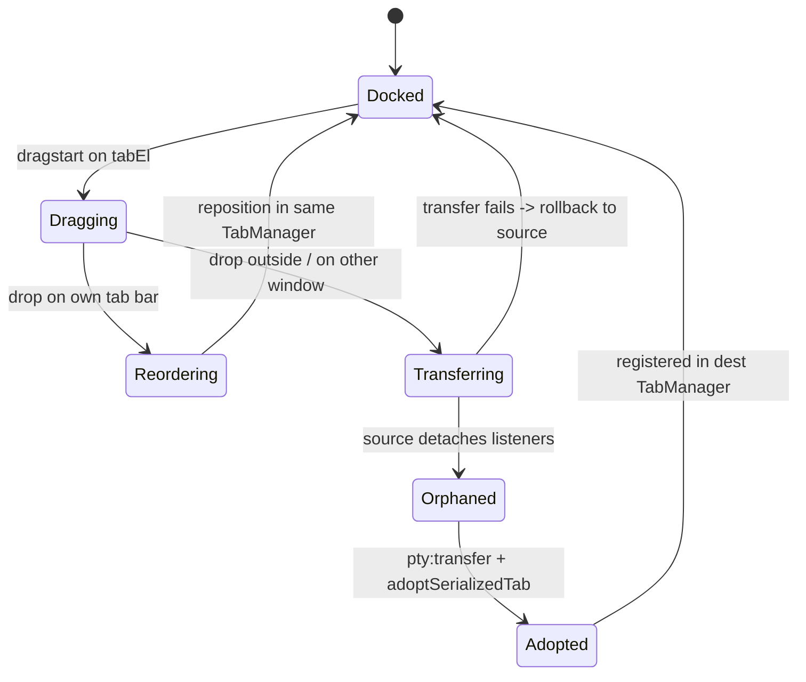
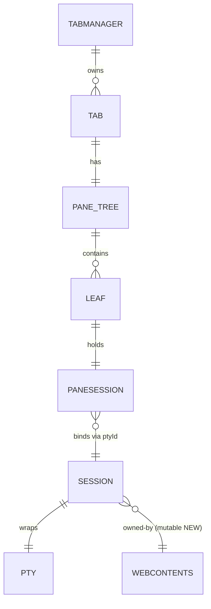
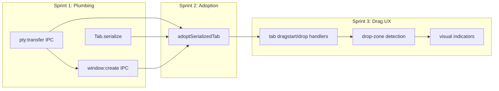

# Tab Drag-Out to New Window

**Status**: Draft
**Complexity**: High
**Created**: June 3, 2026
**Author**: tech@bonjoy.com
**PRD ID**: PRD-2026-06-03-1500

---

## 1. Summary

Add the ability to drag a tab out of the tab bar and drop it to create a new window, and to drag a tab from one window into another window's tab bar — the same behavior iTerm2 and modern browsers offer. This serves power users who run many shells and want to spread sessions across monitors. It matters because tab-to-window is a baseline expectation for a serious terminal, and its absence makes Myanso feel less capable than competitors despite its Myanmar-rendering edge.

---

## 2. Problem

Today a user can open many tabs and split panes, but every tab is trapped inside the window that created it. There is no way to pull a long-running build log onto a second monitor, or to regroup sessions after they pile up in one window. The only escape is "New Window" (`src/main/index.ts:180`), which opens an empty window — the running shell stays behind. Users must manually re-`cd` and re-run commands in the new window, losing the live session.

The cost of inaction is friction for exactly the heavy users Myanso wants to keep. Multi-monitor workflows are impossible, window organization is rigid, and the product reads as "early" next to iTerm2, Warp, and Windows Terminal. Each lost power user also loses the Myanmar-rendering advantage that differentiates the app.

---

## 3. Solution

Build tab-to-window dragging on three pillars:

1. **Live PTY hand-off** — transfer a running shell session's ownership from one window to another without killing it, so the process keeps running.
2. **Tab state serialization** — capture the dragged tab's pane tree and per-pane metadata (cwd, title, dimensions) so the destination window rebuilds an identical layout.
3. **Drag UX** — native-feeling tab drag with drop targets for "new window" (drop outside any tab bar) and "move into window" (drop onto another window's tab bar).

---

## 4. Objectives Table

| # | Objective | Success Metric |
|---|-----------|---------------|
| O1 | Drag a tab out to spawn a new window | Dropping a tab outside any window creates a new window containing that tab; running shell survives |
| O2 | Drag a tab into an existing window | Tab appears in target window's tab bar and is removed from source; PTY uninterrupted |
| O3 | Preserve session liveness | Shell process PID is unchanged before and after the move; no `pty:exit` fires during transfer |
| O4 | Preserve pane layout | Split structure and per-pane cwd/title match source after rebuild (100% of panes) |
| O5 | No regressions | Existing tab click, close, split, and divider drag still pass manual verification |

---

## 5. Scope

### In Scope

**Tab drag interaction (`src/renderer/myanso.ts`)**
- `dragstart` / `dragend` / `drag` handlers on each `Tab.tabEl` button.
- Drop-zone detection: drop on a tab bar = reorder/move-in; drop outside any window bounds = new window.
- Visual drag affordance: dragged-tab ghost + insertion indicator in the tab bar (reuse existing tab styles).

**PTY ownership transfer (`src/main/pty.ts`)**
- New IPC `pty:transfer` that re-points a session's `wc` (WebContents) from the old window to the new one.
- Relax `ownedSession()` only for the transfer handshake; keep strict ownership otherwise.
- Flush any buffered output to the new `wc` after transfer.

**Window creation from renderer (`src/main/index.ts`, `src/preload/index.ts`)**
- New IPC `window:create` (renderer → main) returning the new window's `webContentsId`.
- The new window receives an "adopt tab" payload on load.

**Tab state serialization (`src/renderer/myanso.ts`)**
- `Tab.serialize()` → JSON: pane tree (Branch/Leaf structure, split direction, ratios) + per-Leaf `{ ptyId, cwd, title }`.
- `TabManager.adoptSerializedTab(payload)` → rebuilds the tree, re-registers `leavesByPtyId` / `tabsByPtyId`, re-attaches xterm without re-spawning.

### Out of Scope

- Transferring xterm scrollback / screen history (new window starts with a fresh visible buffer).
- Merging two windows' tab bars by dragging the title bar.
- Drag-to-split (dropping a tab onto a pane to split it).
- Persisting window/tab layout across app restarts (session restore).
- Touchscreen / pen drag input.

### Deferred to Post-MVP

| Feature | Reason | Phase |
|---------|--------|-------|
| Scrollback transfer | Requires serializing xterm buffer; large effort, low payoff | v2 |
| Drag tab onto a pane to split | New drop semantics on pane bodies | v2 |
| Session restore on restart | Separate persistence subsystem | v3 |
| Animated tab tear-off ghost | Polish, not core function | v2 |

### Implementation Notes

- The PTY process never restarts — only the `wc` reference in `pty.ts` and the listener maps in the renderer change. This is the key to O3.
- `sessions` map is already global in `pty.ts:107`, so the session survives even while no window references it during the brief hand-off.
- Reuse the existing pane-rebuild path used when creating splits, rather than writing a parallel layout builder.

### Target Users

| Role | Impact |
|------|--------|
| Power user / developer | Spreads live sessions across monitors; organizes windows freely |
| DevOps / sysadmin | Pulls a monitoring/log tab onto a dedicated screen without losing the tail |
| Myanmar-language users | Same workflow gains while keeping correct Burmese rendering |

---

## 6. Architecture

### Business Flow



### State Machine — Tab transfer lifecycle



`Orphaned` is the risky window: the session exists in `pty.ts` but no renderer is listening. Buffered output in `Session.buf` covers this gap; the transfer must complete or roll back.

### Role / Permission Approach

There are no user roles. The security boundary is **WebContents ownership** of a PTY session. Currently `ownedSession(id, sender)` (`pty.ts:194`) blocks any window but the owner from writing/killing/resizing a session. This PRD adds exactly one sanctioned ownership change via `pty:transfer`; all other access stays gated. The transfer must validate that the requesting flow is legitimate (see Security).

### PTY hand-off model

A session in `pty.ts` holds `{ pty, buf, wc, ready }`. Transfer changes only `wc` (and resets `ready` until the new renderer signals `pty:ready`). The node-pty process and its `onData` listener are untouched, so no output is lost — incoming data appends to `buf` and is flushed to the new `wc` once it is ready.

### Database Entity Relationship

Not applicable — Myanso has no database. State lives in-memory in `pty.ts` (`sessions` map) and in the renderer (`TabManager`). The "entities" are runtime objects:



### Feature Dependency Graph



---

## 7. Codebase Baseline

| Asset | Current State | Change in this PRD |
|-------|--------------|----------------------|
| `createWindow()` (`src/main/index.ts:44`) | Spawns empty window; called by menu only | Accept optional adopt payload; expose via `window:create` IPC |
| `sessions` map (`src/main/pty.ts:107`) | Global `Map<string, Session>`; `wc` set once at spawn | `wc` becomes mutable via `pty:transfer` |
| `ownedSession()` (`src/main/pty.ts:194`) | Strict owner check on write/resize/kill | Add sanctioned transfer path; keep strict elsewhere |
| `s.wc.send("pty:data", …)` (`src/main/pty.ts:127`) | Sends to original owner only | Sends to current `wc`, which may have changed |
| Preload API (`src/preload/index.ts:27`) | `spawn/write/resize/kill/onData/onExit/onMenu` | Add `transfer`, `createWindow`, `onAdopt` |
| `Tab` (`src/renderer/myanso.ts:1683`) | Holds `tabEl`, `rootEl`, pane tree, active leaf | Add `serialize()`; tabEl gains drag handlers |
| `TabManager` (`src/renderer/myanso.ts`) | Owns tabs, `leavesByPtyId`, `tabsByPtyId` | Add `adoptSerializedTab()`, drag routing |
| `PaneSession` (`src/renderer/myanso.ts:540`) | Wraps xterm, owns ptyId, cwd, title | Add `rebindPty()` to attach without re-spawn |

**HIGH-RISK MECHANICAL TASK**: `pty.ts:127` (`s.wc.send`) — every send site must use the *current* `wc`, not a captured reference. Audit all `wc.send` calls so a stale closure does not deliver to the old window.

---

## 8. Technical Design

### New IPC channels

| Channel | Direction | Payload | Purpose |
|---------|-----------|---------|---------|
| `window:create` | renderer → main (invoke) | `{ adopt: SerializedTab }` | Spawn window, return `webContentsId` |
| `pty:transfer` | renderer → main (invoke) | `{ ptyId, targetWcId }` | Re-point `session.wc`; flush buffer |
| `pty:adopt` | main → renderer (event) | `{ tab: SerializedTab }` | Tell destination to rebuild tab |

### Modified runtime objects

| Object | Change | Note |
|--------|--------|------|
| `Session` (`pty.ts`) | `wc` reassignable; reset `ready=false` until new renderer calls `pty:ready` | Buffer flush guarded on `ready` |
| `createWindow()` | optional `adoptPayload`; emits `pty:adopt` after `did-finish-load` | Avoid race: wait for renderer ready |
| `Tab` | `serialize(): SerializedTab` | Pure read; no side effects |
| `TabManager` | `adoptSerializedTab(payload)` | Rebuilds tree, re-registers maps |

### Critical isolation logic

The transfer must not let an arbitrary window steal another window's session. Validate in `pty.ts`:

```ts
// pseudo
ipcMain.handle("pty:transfer", (e, { ptyId, targetWcId }) => {
  const s = sessions.get(ptyId);
  if (!s) return false;
  if (s.wc !== e.sender) return false;        // only current owner may give it away
  const target = webContents.fromId(targetWcId);
  if (!target) return false;
  s.wc = target;                              // hand-off
  s.ready = false;                            // wait for dest pty:ready
  return true;
});
```

The source window (current owner) initiates; it cannot point a session at a window that did not consent because the destination only adopts ptyIds present in the `pty:adopt` payload it received.

### New backend components (main + preload)

| Category | Components |
|----------|-----------|
| **IPC handlers (main)** | `window:create`, `pty:transfer` |
| **Window helper (main)** | `createWindow(adoptPayload?)` extension |
| **Preload API (new methods)** | `pty.transfer(ptyId, targetWcId)`, `window.create(payload)`, `pty.onAdopt(cb)` |
| **Types (`src/renderer/pty-api.d.ts`)** | `SerializedTab`, `SerializedLeaf`, extend `window.pty` / new `window.win` |

### New frontend components (renderer)

| Category | Components |
|----------|-----------|
| **Serialization** | `Tab.serialize()`, `serializePaneTree()` helper |
| **Adoption** | `TabManager.adoptSerializedTab()`, `PaneSession.rebindPty()` |
| **Drag** | `Tab.attachDragHandlers()`, `TabManager.handleTabDrop()`, drop-zone hit-test |
| **UI** | insertion indicator element + dragging CSS class in tab bar |

---

## 9. Detailed Specifications

### Source window — initiating a drag

- **File**: `src/renderer/myanso.ts` (`Tab`, `TabManager`)
- On `dragstart` of `tabEl`: store the dragged `Tab` reference; set a drag image; mark tab bar in "dragging" mode.
- On `dragend`:
  - Compute drop point against all window bounds (via a main-process hit-test helper, since renderer cannot see other windows).
  - **Drop on own tab bar** → reorder DOM order only; no IPC.
  - **Drop outside all windows** → `window.create({ adopt: tab.serialize() })`, then `pty.transfer(ptyId, newWcId)` for each leaf, then remove tab locally.
  - **Drop on another window's tab bar** → route the serialized payload to that window (via main relay), transfer each ptyId, remove locally.

| Serialized field | Source | Used for |
|------------------|--------|----------|
| `tree` | recursive Branch/Leaf walk | Rebuild split layout |
| `splitDir`, `ratio` | `Branch` | Divider position |
| `ptyId` | `PaneSession.ptyId` | Re-bind live shell |
| `cwd`, `title` | `PaneSession` | Restore tab/pane labels |

### Destination window — adopting a tab

- **File**: `src/renderer/myanso.ts` (`TabManager.adoptSerializedTab`)
- Receives `pty:adopt` payload.
- Rebuild the pane tree using the existing split-creation path (do **not** call `pty.spawn`).
- For each leaf: create `PaneSession` shell, call `rebindPty(ptyId)` to attach xterm `onData` without spawning, register in `leavesByPtyId` / `tabsByPtyId`.
- Issue a `pty:resize` so node-pty matches the new window's cell grid.
- Call `pty.ready(ptyId)` so main flushes buffered output.

### Renderer API (preload) — public methods

```
window.pty.transfer(ptyId: string, targetWcId: number): Promise<boolean>
window.win.create(payload: SerializedTab): Promise<number>   // returns webContentsId
window.pty.onAdopt(cb: (payload: SerializedTab) => void): void
window.win.hitTest(x: number, y: number): Promise<number|null> // wcId of window under point, or null
```

---

## 10. Implementation

### Sprint 1: Plumbing (Week 1)

#### 01 - PTY ownership transfer (#TBD)

- [ ] Add `pty:transfer` handler in `src/main/pty.ts` re-pointing `session.wc` with owner validation.
- [ ] Make `session.ready` reset on transfer; gate buffer flush on `ready`.
- [ ] Audit every `wc.send` site in `pty.ts` (esp. line 127) to use current `session.wc`.
- [ ] Add `pty.transfer()` to `src/preload/index.ts` and `pty-api.d.ts`.
- [ ] Manual test: transfer a session id between two manually-opened windows; verify no `pty:exit`.

#### 02 - Renderer-driven window creation (#TBD)

- [ ] Add `window:create` invoke handler; extend `createWindow(adoptPayload?)` in `src/main/index.ts`.
- [ ] Emit `pty:adopt` after destination `webContents` `did-finish-load`.
- [ ] Add `win.create()` + `pty.onAdopt()` to preload + types.
- [ ] Add `win.hitTest(x,y)` main handler using `BrowserWindow.getBounds()`.

### Sprint 2: Serialization & adoption (Week 2)

#### 03 - Tab serialize / adopt (#TBD)

- [ ] Implement `Tab.serialize()` + recursive `serializePaneTree()`.
- [ ] Implement `PaneSession.rebindPty(ptyId)` (attach xterm `onData`, no spawn).
- [ ] Implement `TabManager.adoptSerializedTab()` reusing split-creation path.
- [ ] Re-register `leavesByPtyId` / `tabsByPtyId` on adopt.
- [ ] Issue resize + `pty.ready` after rebuild.
- [ ] Manual test: programmatically serialize a 2-pane tab and adopt it in a fresh window.

### Sprint 3: Drag UX (Week 3)

#### 04 - Tab drag handlers (#TBD)

- [ ] `Tab.attachDragHandlers()` — dragstart/drag/dragend on `tabEl`.
- [ ] `TabManager.handleTabDrop()` — route by hit-test result (own bar / other window / outside).
- [ ] Same-bar reorder path (DOM order, no IPC).
- [ ] New-window path: create → transfer → remove local.
- [ ] Move-into-window path: relay payload → transfer → remove local.
- [ ] Insertion indicator + `.dragging` CSS in tab bar.
- [ ] Manual test: all four golden-path verifications below.

---

## 11. Security

| Concern | Mitigation |
|---------|-----------|
| Window steals another window's PTY | `pty:transfer` validates `session.wc === e.sender`; only current owner can hand off |
| Adopt payload targets a non-consenting window | Destination only transfers ptyIds it received in its own `pty:adopt` payload |
| Stale `wc` send leaks output to wrong window | Audit all `wc.send` to read current `session.wc`; reset `ready` on transfer |
| Buffered output lost during `Orphaned` state | `Session.buf` accumulates; flush only after destination `pty:ready` |
| Renderer-triggered window spawn abuse | `window:create` requires a valid serialized payload; no arbitrary URL/preload override |
| ptyId spoofing | ptyIds are opaque server-generated strings; transfer fails for unknown ids |

---

## 12. Testing

No automated test harness exists (per CLAUDE.md). Validation is type-check + manual.

```bash
npm run typecheck     # all three TS configs must pass
npm run build         # main + preload + renderer compile clean
npm run dev           # launch for manual verification
```

### Manual Verification

1. Open a tab, run `top` (a live process). Drag the tab outside the window → new window opens, `top` still updating, PID unchanged.
2. Open two windows. Drag a tab from window A onto window B's tab bar → tab moves to B, source removes it, shell uninterrupted.
3. Drag a tab within its own tab bar → tabs reorder; no new window, no transfer.
4. Split a tab into two panes (`Cmd+D`), `cd` to different dirs in each, drag the tab to a new window → both panes rebuild with correct cwd/title.
5. Run existing flows after a transfer: `Cmd+T`, `Cmd+D`, `Cmd+W`, divider drag — all still work in both windows.
6. Close the source window after moving its only tab → no orphaned PTY, no crash.

---

## 13. Risks

| Risk | Likelihood | Mitigation |
|------|-----------|-----------|
| Output lost during `Orphaned` window | Medium | Buffer in `Session.buf`; flush gated on destination `pty:ready`; roll back on failure |
| Stale `wc` closure delivers to old window | Medium | Audit all `wc.send`; always dereference `session.wc` live |
| Scrollback gone after move surprises users | High | Document as known limitation; defer full transfer to v2 |
| Race: `pty:adopt` fires before renderer ready | Medium | Emit only after `did-finish-load`; renderer acks with `pty:ready` |
| HTML5 drag-and-drop quirks across OS | Medium | Use Pointer events (same pattern as existing divider drag at `myanso.ts:1863`) instead of HTML5 DnD |
| Cross-window hit-test inaccurate on multi-DPI | Low | Use main-process `getBounds()` in screen coords for hit-test |
| Closing source mid-transfer kills session | Low | Complete transfer before removing local tab; guard `Orphaned` state |

---

## 14. Definition of Done

- [ ] Drag tab outside → new window with live shell (O1)
- [ ] Drag tab into another window → moved, source cleared, uninterrupted (O2)
- [ ] Shell PID unchanged across transfer; no `pty:exit` during move (O3)
- [ ] Split layout + per-pane cwd/title preserved (O4)
- [ ] Existing tab/pane/divider behaviors regression-free (O5)
- [ ] `npm run typecheck` passes (all three configs)
- [ ] `npm run build` clean
- [ ] All six manual verification steps pass
- [ ] Known limitation (no scrollback transfer) documented in README/CLAUDE.md
- [ ] PR reviewed and approved

---

## 15. Files Changed

| Category | Files | Description |
|----------|-------|-------------|
| Main | `src/main/pty.ts` | `pty:transfer` handler, mutable `wc`, `wc.send` audit |
| Main | `src/main/index.ts` | `window:create`, `win:hitTest`, `createWindow(adoptPayload?)`, `pty:adopt` emit |
| Preload | `src/preload/index.ts` | `pty.transfer`, `win.create`, `win.hitTest`, `pty.onAdopt` |
| Types | `src/renderer/pty-api.d.ts` | `SerializedTab`, `SerializedLeaf`, extended API types |
| Renderer | `src/renderer/myanso.ts` | `Tab.serialize`, `PaneSession.rebindPty`, `TabManager.adoptSerializedTab`, drag handlers, drop routing |
| Renderer (CSS) | `src/renderer/` styles | `.dragging` tab state, insertion indicator |

---

## 16. Related

- **Epic Issues**: #TBD
- **Milestone**: Tab/Window UX
- **Sprint Schedule**: Sprint 1 (Week 1), Sprint 2 (Week 2), Sprint 3 (Week 3)
- **Reference**: iTerm2 tab tear-off behavior; existing divider-drag pattern at `src/renderer/myanso.ts:1863`

_Last updated: June 3, 2026_
